# VSCode与Git托管平台使用指南

## 一、前言
本文介绍如何在VSCode中集成使用Git，以及如何在仓库托管平台上进行代码托管与协作，这里以水杉码园为例进行说明，其他平台如GitHub、码云等以Git为基础的托管平台在使用上都是大同小异。内容上主要分成三部分，分别介绍VSCode、Git基本命令以及如何基于水杉码园进行代码托管与协作。

## 二、Visual Studio Code
（一）安装VSCode
访问 https://code.visualstudio.com/Download 下载符合您机器平台的安装包后进行安装。

（二）界面介绍
VSCode打开后的界面如下图所示：
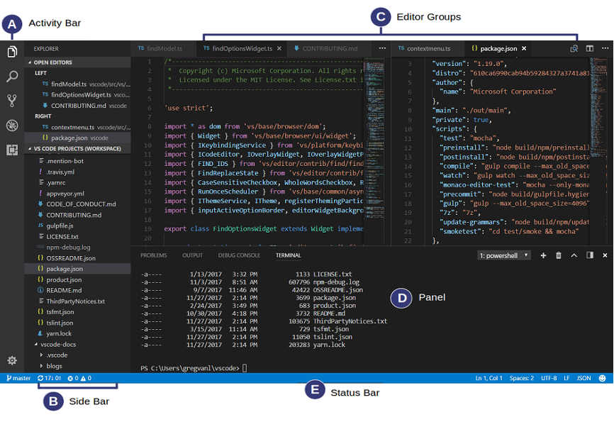

A区是侧边活动栏，B区是底部栏，C区是编辑区域，D区是面板区域，E区是状态栏，当然顶部还有一个菜单栏。VSCode区域划分的非常友好，对文件进行编辑的同时也可以在面板区域中查看终端的输出信息等。

（三）插件介绍
	能够让VSCode火爆的原因就是它拥有庞大的插件库，在A区的活动栏中选择插件活动，就可以在市场中搜索你想要的插件。它可以帮你实现代码高亮、自动补全、格式校验等功能，对编辑代码有着非常好的帮助。
## 三、Git
（一）Git是什么
Git是一个版本控制系统工具，它可以帮你管理项目，记录每一次提交的变化，以方便你在发生错误时进行回滚。它几乎所有的控制操作都可以在本地执行，不需要网络开销的好处是Git的操作十分迅速。

（二）安装Git
访问 https://git-scm.com/downloads ，根据自己的机器平台下载合适的安装包后进行安装。

（三）添加到Path
打开终端，输入git并回车。如果有git信息，则说明已经将git添加到path中，否则请找到git安装位置，然后添加到你系统的path中。各系统方式不同，请自行查阅资料。
正常情况下的反应如下：
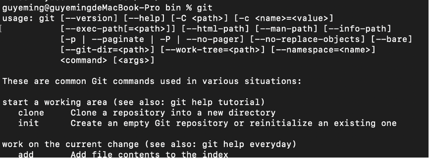

## 四、水杉码园
（一）登陆[水杉在线](https://www.shuishan.net.cn)，跳转到水杉码园
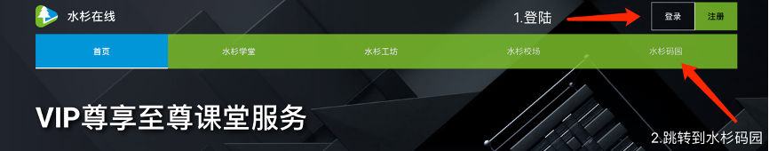
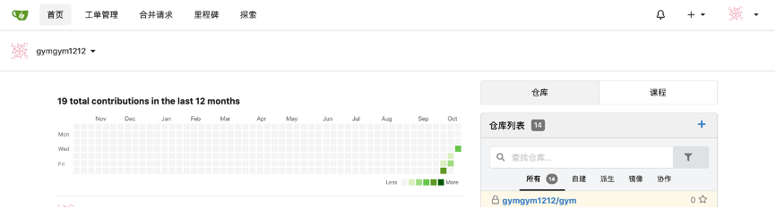

（二）查看邮箱，并配置Git信息
首先在水杉码园右上角的头像，点击个人信息。
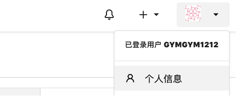

查看你水杉码园账户的对应邮箱，等下要用。
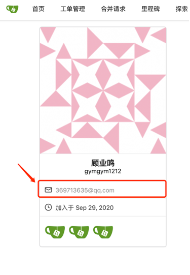

打开终端，输入以下命令用以设置你本地git的姓名和邮箱信息。请确保邮箱和刚刚水杉码园中查看到的邮箱相同。
`$ git config --global user.name "Your Name"`
`$ git config --global user.email yourmail@example.com`

设置完后可以通过下面命令查看姓名和邮箱：
`$ git config user.name`
`$ git config user.email`

正常情况下的输出如图所示：
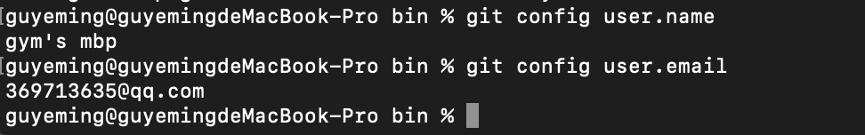

（三）在本地（你的笔记本电脑）生成SSH密钥
	在命令行输入ssh-keygen -t rsa -C ‘你的邮箱地址’后回车，如下：
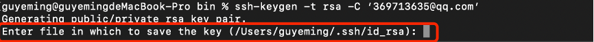
	
红框中是提示你要将密钥存放在哪里，括号里的是默认的存放路径，请记住这个路径，我们之后需要这个路径找到密钥。
接着直接按回车，如果你之前也按照默认的路径生成过SSH密钥，会出现如下图中的情况，询问你是否要覆盖。
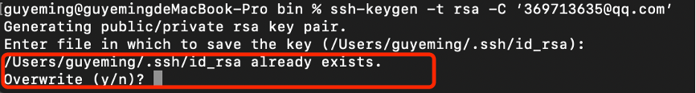
输入y覆盖原有的密钥，或者之前没有生成过密钥，就会出现如下图中情况：
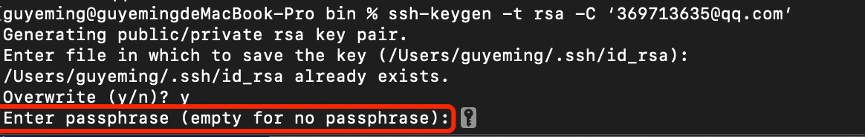

直接回车不用管，如下：
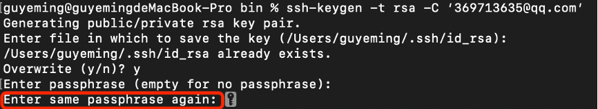

直接回车不用管，之后如下：
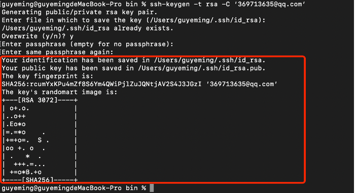

可以看到你的密钥已经创建成功。

（四）上传密钥到水杉码园
登陆水杉码园后，在右上角头像的下拉框中点击设置
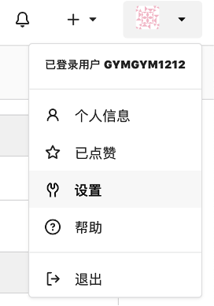

在标签中选择SSH/GPG密钥

在管理SSH密钥卡片右侧点击增加密钥
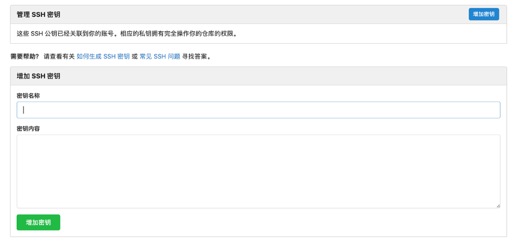

打开你的id_rsa.pub文件，将里面所有的内容复制到密钥内容一栏中，然后给这个密钥取一个名字，比如：我的MacBook。点击绿色的增加密钥按钮后，就成功添加了SSH密钥。

（五）新建远程仓库
点击头像边上的加号，接着点击创建仓库
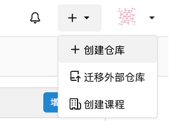

为仓库取一个名字后点击下面的创建仓库按钮，就可以正常创建仓库了，如果你不想让别人看到你的仓库内容，记得设置你的仓库为私有。
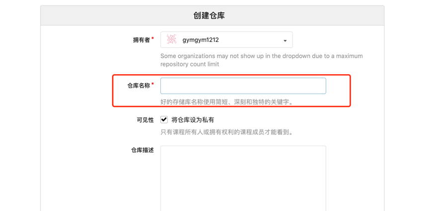

（六）你的仓库SSH地址
当你创建完仓库后，你会跳转到仓库的主页，如下图所示：
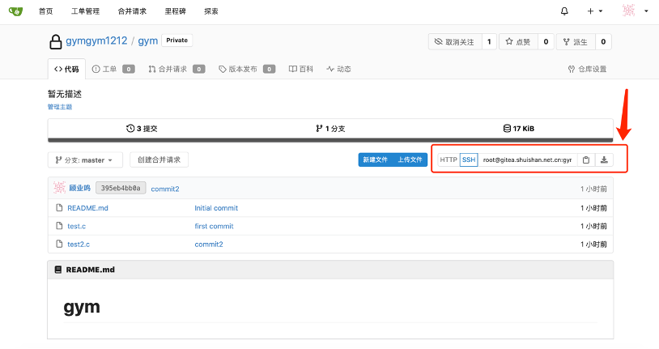
上图红框中，选择SSH，就可以看到你仓库的SSH地址，这个之后会用到。
五、VSCode集成Git使用
（一）拉取仓库
打开VSCode，在左边选择git活动。
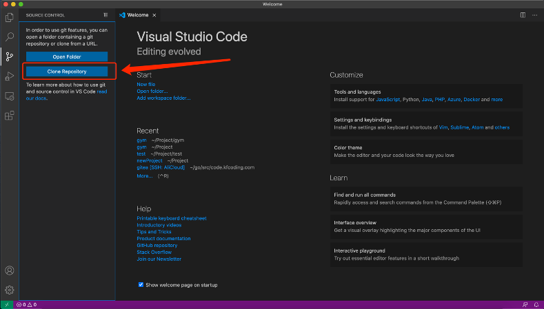

点击上图红框中的按钮，然后在弹出的框中复制你刚才仓库的SSH地址，然后回车。
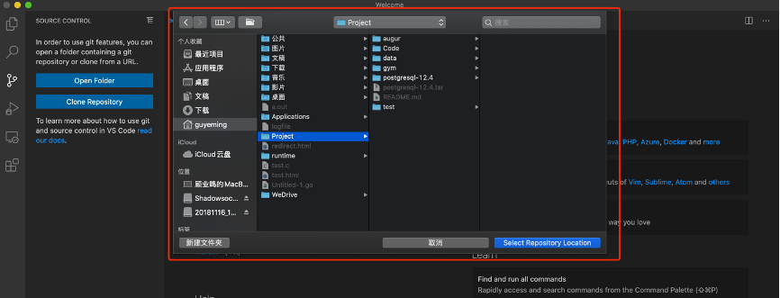

选择仓库的存放地址，即可将仓库拉取到本地。接着右下角会弹出一个是否打开该仓库的提示，点击open打开该仓库。

（二）修改仓库文件
你可以随意修改仓库文件，只要添加了一些新的文件或者有了一些新的修改即可。
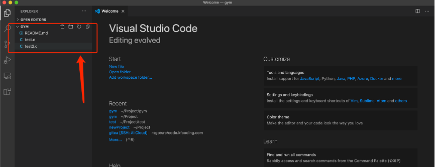
我们添加了两个源文件用于进行接下去的步骤

（三）暂存修改的文件
按下图进行操作，这会将你所有的修改放入暂存区
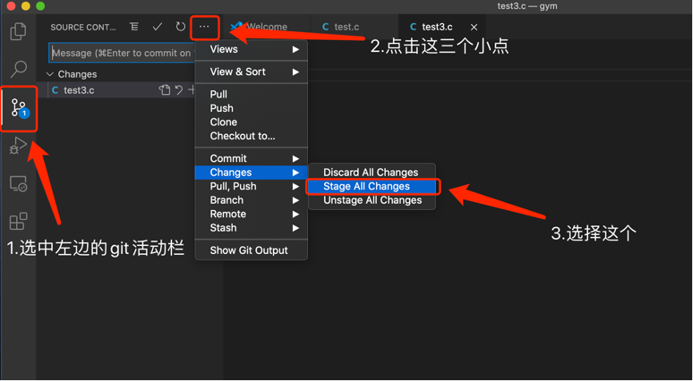

（四）提交暂存的文件
按下图进行操作，将暂存区的修改文件进行提交。这不是提交到远程仓库，是提交到本地git，产生一个新的commit。
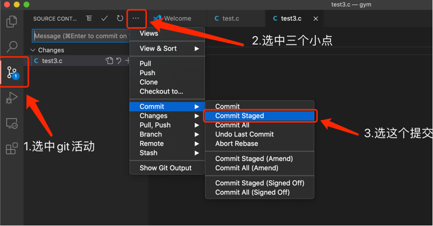
紧接着，在弹出的框中，输入你这次提交的备注信息，用于说明你这次commit主要的内容是什么。
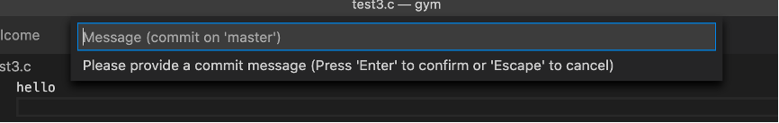

（五）推送到水杉码园远程仓库
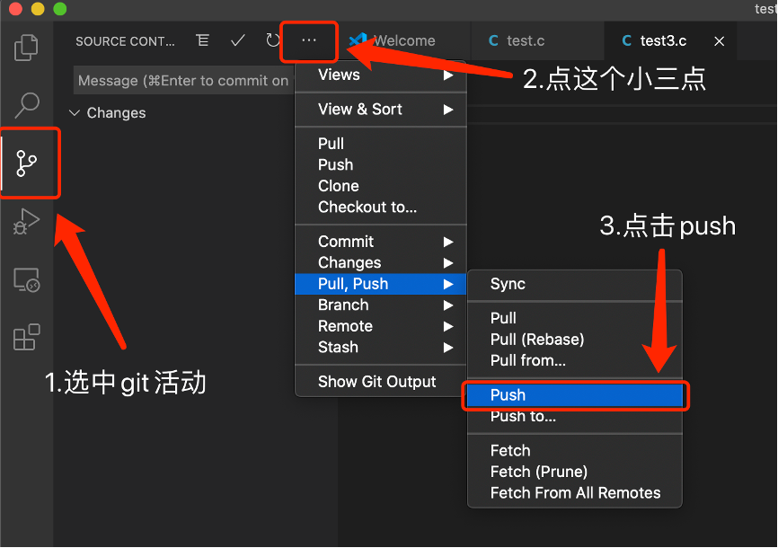
即可正确推送到水杉码园。

（六）切换分支
通常我们不是只在一个分支上开发，master分支用来存放当前开发的稳定分支。可以按照下图产生并切换到新分支。
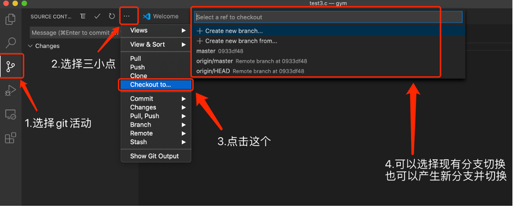

六、Git命令介绍
（一）创建仓库
`$ git init`
这会将当前目录创建为一个仓库，并产生一个新的名为.git的文件夹，其中存储着版本控制信息，我们不需要去在意里面具体是什么。这样，我们就创建好了一个空的仓库。

（二）添加文件并查看仓库
现在让我们尝试在我们新的空仓库（就是你创建的文件夹下）中添加一个新的文件，可以是一个word，可以是一份c语言源文件，其他什么文件都可以。当你添加了一个文件后，我们使用下面的命令去查看当前的仓库情况：
`$ git status`
终端会显示出你目前在master分支上还没有过提交，并且有一个文件还未被git追踪。
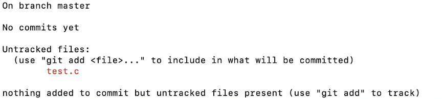

（三）追踪、提交文件
接着我们使用下面命令去追踪文件：
`$ git add .`
注意add后面这个点不要漏了，这代表加入所有未被追踪的文件到git中。然后使用下面的命令去提交我们这次文件改动，顺带写上一些信息表示我们这次提交的主要内容。
`$ git commit -m "my first file"`
注意使用选项-m去加上提交的信息，如果直接使用git commit会调用编辑器让你继续输入你这次提交的主要信息。

（四）查看分支
紧接着，你可以在终端中输入如下命令查看分支：
`$ git branch`
结果应该如下图所示：

注意，如果你发现没有任何输出，那就说明上面的commit操作你还没成功，因为我们刚刚创建的仓库是空的，在Git中分支必须指向一个commit。如果还没有commit任何文件，那么就看不到分支。当我们第一次提交后就会自动将master分支作为我们的主要分支，指向你的第一次提交。然后你再使用一次git branch命令就能查看分支，并且分支名字前面带*的就是当前所处的分支。

（五）创建并切换分支
Master分支一般更多是用来保存完整的项目内容，当你进行开发或者修改bug的时候应该切换到新的分支进行开发工作。你可以使用下面命令创建一个新的分支：
`$ git branch dev`
这样，你就创建了一个名为dev的分支。
你可以使用下面命令切换分支：
`$ git checkout dev`
这样你就切换回了master分支。你也可以把这两步操作合并一下，用这个命令：
`$ git checkout -b dev`
这样你就会创建dev分支然后切换过去。